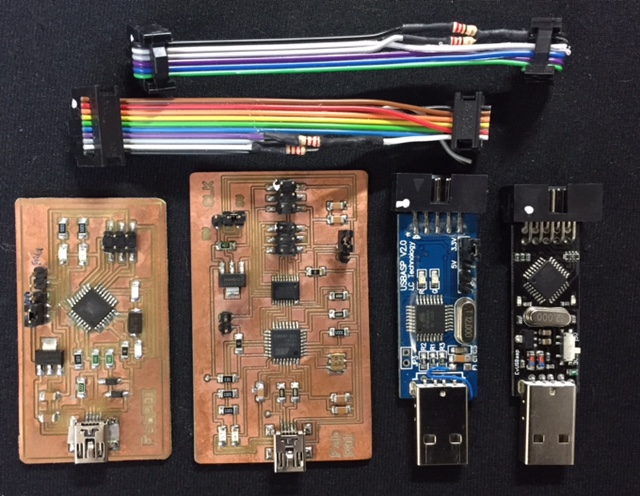

## FabPDI
**DIY PDI/ISP programmer**

The thought of building a DIY PDI programmer first came to me during [Embedded Programming](http://archive.fabacademy.org/2016/fablabsingapore/students/98/exercise08.html) week in Fab Academy 2016, when Neil talked about the ATxmega16E5 microcontroller. I was itching to try it out, but lacked a PDI programmer.

After some research, I learned that I could modify a [USBasp](http://www.fischl.de/usbasp/) into a PDI programmer. The second alternative was to build an [AVRISP-MkII clone](http://www.fourwalledcubicle.com/AVRISP.php). Since I had a couple of USBasp boards, I thought "*why not?*"

My attempt at modifying my USBasp board failed and is documented in my Fab Academy [website](http://archive.fabacademy.org/2016/fablabsingapore/students/98/exercise08.html). What I lacked at that time was a [schematic diagram](images/usbasp_v2.0_sch.jpg) of my USBasp board. I soon abandoned the attempt at modifying my USBasp board due to the limited time available, but the desire to build my own PDI programmer stayed with me all the time.

Since Fab Academy 2016, I have managed to build 2 different versions of fabbable PDI programmers, which I have documented here. I have also successfully modified 2 different versions of commercial USBasp boards for PDI programming.

1. [**FabPDI-mega8**](fabpdi-mega8.md)
   * modified USBasp
   * based on ATmega8
   * uses VUSB library
   * both PDI & ISP programmer
2. [**FabPDI-t90usb**](fabpdi-t90usb.md)
   * AVRISP-MkII compatible
   * based on AT90usb162
   * uses LUFA library
   * both PDI & ISP programmer
3. [**USBasp PDI programmer**](usbasp-mods.md)
   * modified commercial USBasp boards
   * both PDI & ISP programmer

My collection of DIY and modified PDI programmer boards:

*PDI boards collection (from left): FabPDI-mega8, FabPDI-t90usb, USBasp v2.0 (LC Technology), USBasp (Baite)*

*(c) Steven Chew*

MIT license*
