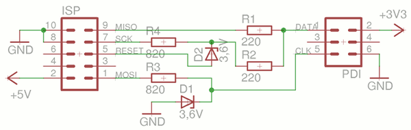
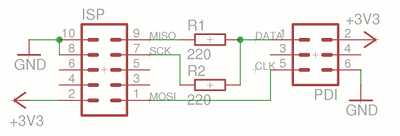
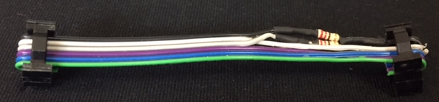
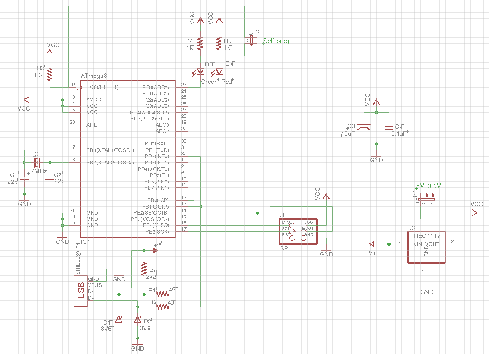
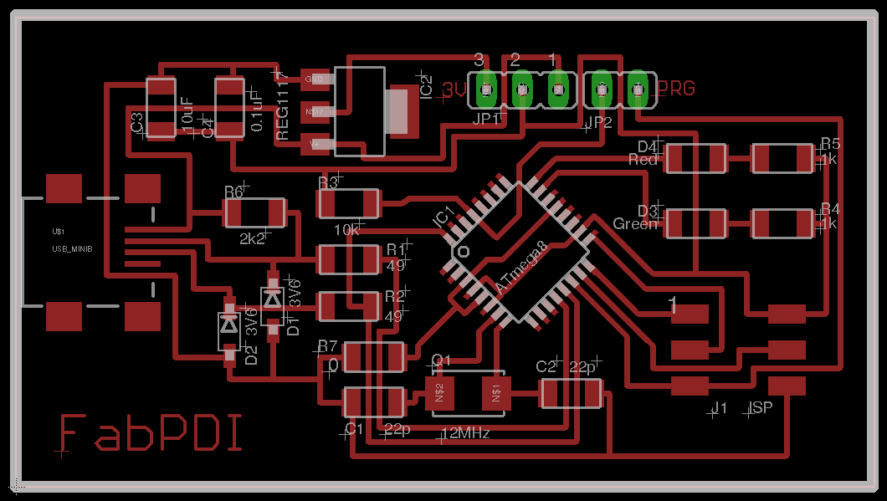
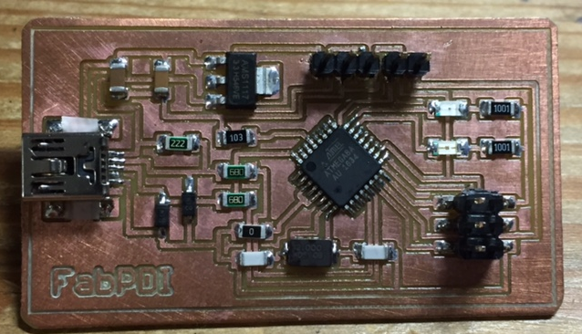
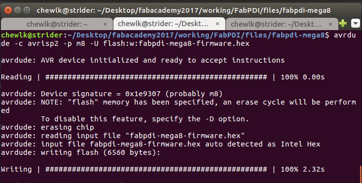
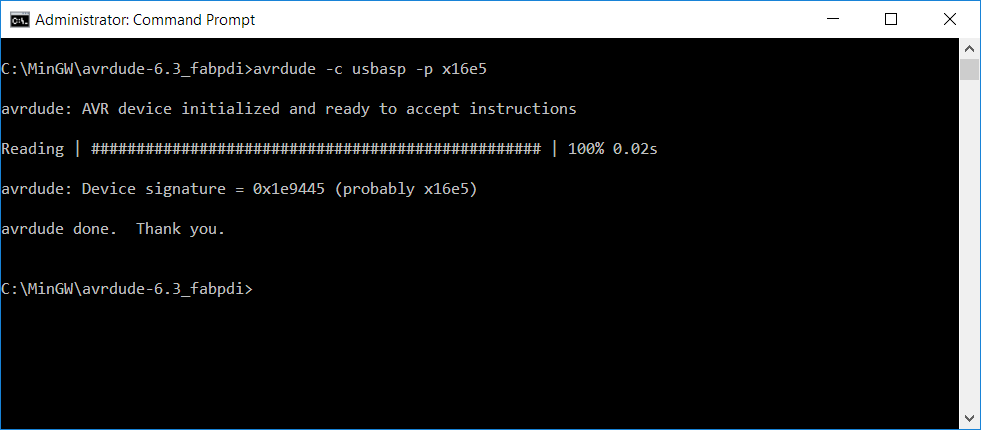
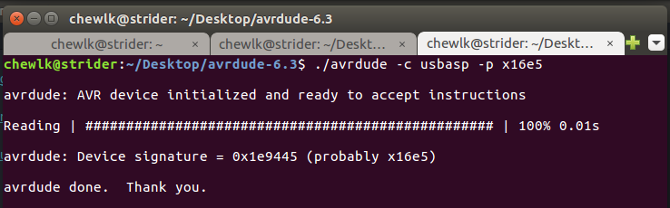

## FabPDI-mega8
The **FabPDI-mega8** programmer is based on a modified USBasp for PDI programming. The main features of this board are:
* modified USBasp
* based on ATmega8
* uses the V-USB library
* operates as both PDI & ISP programmer

You could use an ATmega88, ATmega168 or ATmega328 instead of the ATmega8, but will need to re-compile the firmware for the new microcontroller from source.

There are 3 parts to building the FabPDI-mega8 programmer:
1. Building a PDI programming cable
2. Building the FabPDI-mega8 board and uploading the modified USBasp firmware to it
3. Compiling a modified version of avrdude that recognizes the FabPDI-mega8 as a PDI programmer

My main references in building the FabPDI-mega8 programmer were articles from:
* [Szulat](http://szulat.blogspot.sg/2012/08/atxmega-programmer-for-050.html)
* [Ketturi](https://ketturi.kapsi.fi/2013/05/programming-xmega-with-usbasp-avrdude/)

and I am indebted to these authors for the information that I gleaned from their sites.

## Building a PDI Programming cable
A regular USBasp uses a 5V supply. The ATxmega series ICs operate at 3.3V, including the data pins. There are a few ways to resolve this problem:
1. Use a separate 3.3V power supply and zener diodes to limit the voltages to 3.3V
2. Ensure that our FabPDI-mega8 can switch completely (including data pins) between 5V and 3.3V operation

2 versions of the PDI programming cable can be fabricated, depending on which of the 2 approaches above is used.

*PDI programming cable for a 5V board*

*PDI programming cable for a 3.3V board*

For my FabPDI-mega8 board, I modified the original USBasp design such that the board can switch completely between a 5V supply and a 3.3V supply. I kept the cable short to minimize issues with noise and timing disruptions to the PDI protocol and spliced the 220 ohm resistors directly into the ribbon cable.

A regular 6-way cable is used for ISP programming.

## Building the FabPDI-mega8 Board
###**Schematic Diagram and PCB Layout**

The schematic diagram, component layout, fab modules compatible board outline and pcb traces are shown below.

The schematic is a modified version of Thomas Fischl's [original USBasp](http://www.fischl.de/usbasp/) circuit. Component values have been modified for Fablab inventory as far as possible and the ATmega8 microcontroller switches completely between 5V and 3.3V. I opted to use a 12 MHz crystal as per Thomas's original design as I had some available. If you use a different crystal frequency, you will to change the fuse bits and clock value in the source code as well.

*FabPDI-mega8 schematic*

*FabPDI-mega8 board layout*

Fab modules downloads:

* [FabPDI-mega8 board outline](images/fabpdi-mega8_outline.png)
* [FabPDI-mega8 pcb trace](images/fabpdi-mega8_traces.png)

Mill and Stuff the PCB

###**Component List**

| Component | Component |
| :------- | :-------- |
| 1 x ATmega8A-AU | 1 x Mini-USB |
| 1 x AMS1117-3.3 regulator | 1 x PinHD 2x3 ISP |
| 2 x 3V6 zener | 1 x PinHD 1x2 |
| 1 x LED red | 1 x PinHD 1x3 |
| 1 x LED green | 1 x 12MHz crystal |
| 1 x 10uF capacitor | 1 x 0.1uF capacitor |
| 2 x 22pF capacitor | 1 x 10k ohm R |
| 1 x 2k2 ohm R | 2 x 1k ohm R |
| 2 x 49 ohm R | 1 x 0 ohm R |

###**Programming the Firmware**
The original USBasp firmware has to be modified to support PDI programming. Szulat's [article](http://szulat.blogspot.sg/2012/08/atxmega-programmer-for-050.html) lists the steps used to modify the firmware. You basically need to do the following:

1. Download Thomas Fischl's USBasp [sourcecode](http://www.fischl.de/usbasp/usbasp.2011-05-28.tar.gz) (latest version)
2. Download the patch file at this [link](http://sz.toyspring.com/usbasp-pdi-usbaspfirmware-20120816.diff)
3. Unpack the sourcecode, apply the patch, then compile the file
4. Upload it to the FabPDI-mega8 board using another ISP programmer

To simplify the process, you can download the modified USBasp firmware for PDI programming [here](files/fabpdi-mega8/fabpdi-mega8-firmware.hex) and flash it to the board as follows:

`avrdude -c avrisp2 -p m8 -U flash:w:fabpdi-mega8-firmware.hex`
`avrdude -c avrisp2 -p m8 -U hfuse:w:0xc9:m -U lfuse:w:0xef:m`

**Note:** Remember to short the programming jumper (JP2 in my schematic) when you are flashing the firmware.

Disconnect the ISP programmer, remove the self-programming jumper (JP2) from the FabPDI-mega8 board and reconnect it to your computer. If you have done everything correctly, the board will now identify itself on the PC. In Linux:

`lsusb`

gives

*Bus 008 Device 009: ID 16c0:05dc Van Ooijen Technische Informatica shared ID for use with libusb*

If you have gotten this far, congratulations! You are almost there. There is just one more part remaining - patching avrdude to recognize FabPDI-mega8 for PDI programming.

## Patching AVRDUDE
I followed the information in [Szulat's](http://szulat.blogspot.sg/2012/08/atxmega-programmer-for-050.html) and [Ketturi's](https://ketturi.kapsi.fi/2013/05/programming-xmega-with-usbasp-avrdude/) sites to patch avrdude for PDI programming when I first started.

The instructions from Szulat's site used avrdude version 5.11 (r1092). After compiling avrdude, I found that that version of avrdude only supported the ATxmega series A and D devices, not the series E devices which we use in Fablab. Since I didn't have ATxmega A or D devices, I could not verify if the patch worked. I also could not get the patch file to work with a newer release of avrdude, which supports the ATxmega16E5.

Ketturi's site slightly better. Following instructions at his site, I could compile avrdude under MinGW, but not in Linux. Ketturi provided a precompiled version of avrdude for Windows, but again, this was avrdude version 5.11, which did not support the ATxmega series E devices.

To cut a long story short, after a lot of research and much trial and error, I have successfully managed to compile the latest version of avrdude (version 6.3) for both Windows and Linux environments, which support the ATxmega series E devices like the ATxmega16E5 used in Fab Academy.

The compiled binaries can be download from the links below.
* [AVRDUDE v6.3 for Windows](files/fabpdi-mega8/avrdude-6.3_win32.zip)
* [AVRDUDE v6.3 for Linux](files/fabpdi-mega8/avrdude-6.3_linux.tar.gz)

To use the files, unpack the files into a subdirectory or folder. In Windows, open a command prompt window and change to that directory and run it. In Linux, open a terminal, change to the avrdude directory and run it. The FabPDI-mega8 programmer identifies itself as a usbasp device.

**Remember** - You need to use the modified programming cable for PDI programming and set the voltage selection jumper to 3.3V if you are programming an ATxmega device.

### For Windows
Unpack avrdude-6.3_win32.zip. Open a command prompt window, then change to the avrdude subdirectory. Run avrdude:

`avrdude -c usbasp -p x16e5`

### For Linux
Open a terminal window. Unpack avrdude-6.3_linux.tar.gz. Change to the program directory, then run avrdude:

`tar xvzf avrdude-6.3_linux.tar.gz`
`cd avrdude-6.3`
`avrdude -c usbasp -p x16e5`

***Congratulations! You have built your very own FabPDI programmer!!***

## Files
* [Eagle schematic for FabPDI-mega8](files/fabpdi-mega8/fabpdi-mega8.sch)

* [Eagle pcb layout for FabPDI-mega8](files/fabpdi-mega8/fabpdi-mega8.brd)

* [Firmware for FabPDI-mega8](files/fabpdi-mega8/fabpdi-mega8-firmware.hex)

* [AVRDUDE v6.3 for Windows](files/fabpdi-mega8/avrdude-6.3_win32.zip)

* [AVRDUDE v6.3 for Linux](files/fabpdi-mega8/avrdude-6.3_linux.tar.gz)

*Copyright (c) 2017-Steven Chew*

*MIT license*
