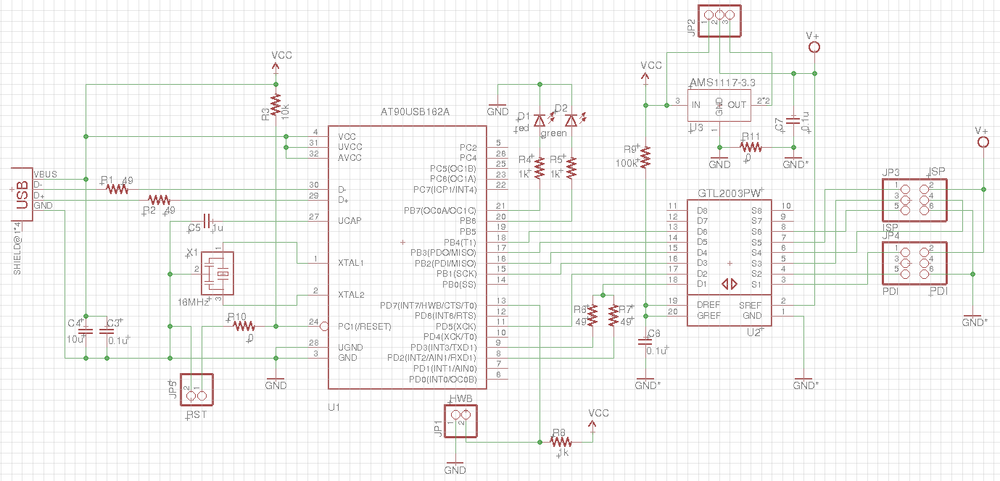
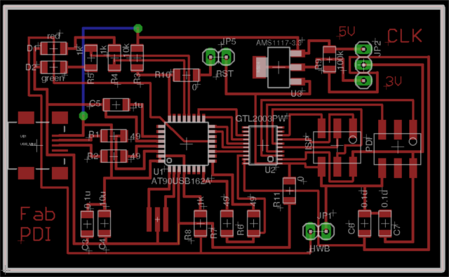

## FabPDI-t90usb
The FabPDI-t90usb programmer is a PDI/ISP programmer, based on Atmel's [AVRISP-MkII](http://www.atmel.com/tools/avrispmkii.aspx). The main features of this board are:
* based on Atmel's AVRISP-MkII
* uses the AT90usb162 microcontroller
* [LUFA library](http://www.fourwalledcubicle.com/LUFA.php) by Dean Camera
* operates as both PDI & ISP programmer

You could substitute the AT90usb162 by other members of the AT90usb family or the ATmega16U2 or higher devices, as long as it has > 16 kB memory and hardware USB support.

Since the FabPDI-t90usb board is a clone of the AVRISP-MkII, it will work directly with standard versions of AVRDUDE without any need to patch the software.

There are 2 steps involved in building the FabPDI-t90usb programmer:
1. Mill and stuff the PCB
2. Upload firmware to the board

My main references for this project were:
* [USBtiny-mkII by mdiy](http://mdiy.pl/programator-usbtiny-mkii-slim/?lang=en)
* [LUFA library & Projects](http://www.fourwalledcubicle.com/AVRISP.php)

## FabPDI-t90usb Schematic & PCB Layout
The AVRISP-MkII clone project at [fourwalledcubicle](http://www.fourwalledcubicle.com/AVRISP.php) supports PDI, ISP and TPI programming. Since I was only interested in implementing the PDI and ISP protocols, I left out the TPI programming interface, to reduce the dimensions of the PCB.

*FabPDI-t90usb schematic diagram*

*FabPDI-t90usb pcb layout*

**Note** the use of a jumper wire at the top left of the pcb layout diagram. There are 2 other 0 ohm resistors in my design. I opted to use a jumper wire to save time, instead of trying to changing the component placement and re-route the entire board.

**Tip**: when I started laying out the PCB, I did not know if I needed any 0 ohm resistors or where they should be located. To add a 0 ohm resistor in Eagle board layout, you need to de-link the PCB editor from the Schematic editor. You can do this by closing the Schematic editor. This allows you to add components in the PCB editor, but you lose the ability to do forward or backward annotation.

Fab modules downloads (1269dpi):

* [FabPDI-t90usb board outline](images/fabpdi-t90_outline.png)
* [FabPDI-t90usb pcb trace](images/fabpdi-t90_traces.png)

### Mill and stuff the pcb.

Most of the traces are 15 mil wide, except for the traces connected to the [GTL2003-PW](http://www.nxp.com/docs/en/data-sheet/GTL2003.pdf) voltage level translator. The pins on this device are very fine and close together, so care must be taken in soldering this chip.

*Completed FabPDI-t90usb board*

## Component List
| Components | Components |
| :--------- | :--------- |
| 1 x AT90usb162 | 1 x Mini-USB |
| 1 x GTL2003PW | 2 x PinHD 2x3 ISP |
| 1 x AMS1117-3.3 regulator | 2 x PinHD 1x2 HW, RST |
| 1 x 16 MHz crystal | 1 x PinHD 1x3 |
| 1 x LED red | 1 x LED green |
| 1 x 10uF capacitor | 1 x 1uF capacitor |
| 3 x 0.1uF capacitor | 2 x 22pF capacitor |
| 1 x 100k ohm R | 1 x 10k ohm R |
| 3 x 1k ohm R |  4 x 49 ohm R |

## Programming the firmware
### For Linux

### For Windows

## Files
* [Eagle FabPDI-t90usb schematic (v1)](files/fabpdi-t90usb/fabpdi-t90usb_v1.sch)
* [Eagle FabPDI-t90usb pcb layout (v1)](files/fabpdi-t90usb_v1.brd)
* [Eagle FabPDI-t90usb schematic (v1.1)](files/fabpdi-t90usb/fabpdi-t90usb_v1.1.sch)
* [Eagle FabPDI-t90usb pcb layout (v1.1)](files/fabpdi-t90usb/fabpdi-t90usb_v1.1.brd)

*Copyright (c) 2017 Steven Chew*

*MIT license*
