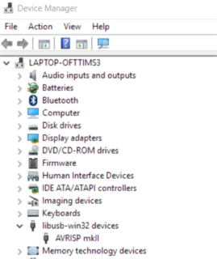

## FabPDI-t90usb
The FabPDI-t90usb programmer is a PDI/ISP programmer, based on Atmel's [AVRISP-MkII](http://www.atmel.com/tools/avrispmkii.aspx). The main features of this board are:
* based on Atmel's AVRISP-MkII
* uses the AT90usb162 microcontroller
* [LUFA library](http://www.fourwalledcubicle.com/LUFA.php) by Dean Camera
* operates as both PDI & ISP programmer

You could substitute the AT90usb162 by other members of the AT90usb family or the ATmega16U2 or higher devices, as long as it has > 16 kB memory and hardware USB support.

Since the FabPDI-t90usb board is a clone of the AVRISP-MkII, it will work directly with standard versions of AVRDUDE without any need to patch the software.

There are 2 steps involved in building the FabPDI-t90usb programmer:
1. Mill and stuff the PCB
2. Upload firmware to the board

My main references for this project were:
* [USBtiny-mkII by mdiy](http://mdiy.pl/programator-usbtiny-mkii-slim/?lang=en)
* [LUFA library & Projects](http://www.fourwalledcubicle.com/AVRISP.php)

## FabPDI-t90usb Schematic & PCB Layout
The AVRISP-MkII clone project at [fourwalledcubicle](http://www.fourwalledcubicle.com/AVRISP.php) supports PDI, ISP and TPI programming. Since I was only interested in implementing the PDI and ISP protocols, I left out the TPI programming interface, to reduce the dimensions of the PCB.


*FabPDI-t90usb schematic diagram*


*FabPDI-t90usb pcb layout*

**Note** the use of a jumper wire at the top left of the pcb layout diagram. There are 2 other 0 ohm resistors in my design. I opted to use a jumper wire to save time, instead of trying to changing the component placement and re-route the entire board.

**Tip**: when I started laying out the PCB, I did not know if I needed any 0 ohm resistors or where they should be located. To add a 0 ohm resistor in Eagle board layout, you need to de-link the PCB editor from the Schematic editor. You can do this by closing the Schematic editor. This allows you to add components in the PCB editor, but you lose the ability to do forward or backward annotation.

Fab modules downloads (1269dpi):

* [FabPDI-t90usb board outline](images/fabpdi-t90_outline.png)
* [FabPDI-t90usb pcb trace](images/fabpdi-t90_traces.png)

### Mill and stuff the pcb.

Most of the traces are 15 mil wide, except for the traces connected to the [GTL2003-PW](http://www.nxp.com/docs/en/data-sheet/GTL2003.pdf) voltage level translator. The pins on this device are very fine and close together, so care must be taken in soldering this chip.


*Completed FabPDI-t90usb board*

### Testing the board
After milling & stuffing the FabPDI-t90usb, connect it to a USB port. In Windows, check *Device Manager* to verify that the board is correctly detected by the system. In Windows, the FabPDI-t90usb identifies itself as an AVRISP mkII. In Linux, enter the command ***lsusb*** in a terminal screen. You should see a new device called ***at90usb162 DFU***.


## Component List
| Components | Components |
| :--------- | :--------- |
| 1 x AT90usb162 | 1 x Mini-USB |
| 1 x GTL2003PW | 2 x PinHD 2x3 ISP |
| 1 x AMS1117-3.3 regulator | 2 x PinHD 1x2 HW, RST |
| 1 x 16 MHz crystal | 1 x PinHD 1x3 |
| 1 x LED red | 1 x LED green |
| 1 x 10uF capacitor | 1 x 1uF capacitor |
| 3 x 0.1uF capacitor | 2 x 22pF capacitor |
| 1 x 100k ohm R | 1 x 10k ohm R |
| 3 x 1k ohm R |  4 x 49 ohm R |

### Update
I have since revised my PCB layout to make it a bit smaller and easier to mill on our Fablab standard 3" x 2" copper blanks. I did this by shifting the placement of some of the components and changing the location of one of the 0 ohm resistors. The revised schematic & pcb layout are below.


*Revised schematic diagram*


*Revised pcb layout*

Fab modules download (1269dpi):
* [FabPDI-t90usb board outline](images/fabpdi-t90usb_outline.png)
* [FabPDI-t90usb pcb trace](images/fabpdi-t90usb_traces.png)

## Programming the firmware
### For Windows
The FabPDI-t90usb is a DFU class device and can be programmed via the DFU protocol. Download and install the Atmel [FLIP](http://www.atmel.com/tools/flip.aspx) software. The software requires Java Runtime Environment. 2 versions of the software are available at the Atmel site - with and without JRE. I opted to install the version with JRE, as the installation would then take care of all dependencies and environment variables required.

After the software is installed, install the DFU drivers from the \Program Files\Atmel\Flip 3.4.7\usb folder. Start FLIP, click on the **"CHIP"** icon and select at90usb162 from the list. Then click on the **"usb cable"** icon, select **USB** and **OPEN**. FLIP should detect the programmer.

To program the board, jumper the **HWB** pins. Short the **RST** pins momentarily. The board will start in bootloader mode. If the AT90usb162 is brand new (empty), it will automatically start in bootloader mode.


*Board showing jumper locations*

Download the pre-compiled [firmware](files/fabpdi-t90usb/fabpdi-t90usb_firmware.hex). Click on the **"Open Book"** and load the firmware. In the left column of the FLIP window, check the **"Erase"**, **"Program"** and **"Verify"** checkboxes. Click the **RUN** button. After the firmware has been uploaded to the board, disconnect and reconnect it. Alternatively, just short the **RST** pins. The two LEDs should light up and then the red LED will remain ON. The FabPDI-t90usb is ready for use.

The board should now show up as AVRISP-MkII in Devce Manager.



*FabPDI-t90usb after uploading firmware*

Congratulations!

### For Linux
I have tried 2 different ways of programming the FabPDI-t90usb board in Linux - using the open-source [dfu-programmer](https://dfu-programmer.github.io/) and Atmel's [FLIP](http://www.atmel.com/tools/flip.aspx) programming software.

**Using DFU-programmer**

To install DFU programmer in Ubuntu, in a terminal window, type:

`sudo apt-get install dfu-programmer`

Connect the FabPDI-t90usb board to a usb port. In terminal, type:

`lsusb`

The AT90usb162 device should show up in the listing:
`Bus 008 Device 044: ID 03eb:2ffa Atmel Corp. at90usb162 DFU bootloader`

If you cannot find a similar listing, the device may not be connected in DFU mode. Check that the **HWB** jumper is set and short the **RST** pins momentarily.

Download the [firmware](files/fabpdi-t90usb/fabpdi-t90usb_firmware.hex) for FabPDI-t90usb. Open a terminal and change to the directory where the file has been saved.

Ensure that the AT90usb162 has been erased prior to programming:

`dfu-programmer at90usb162 erase`

Upload the FabPDI-t90usb firmware to the onboard flash memory:

`dfu-programmer at90usb162 flash fabpdi-t90usb_firmware.hex`

Disconnect the board, remove the **HWB** jumper and reconnect it to a usb port. The two LEDs should light up, then the red LED will remain ON. The FabPDI-t90usb is ready for use.

In a terminal window, type:

`lsusb`

The FabPDI-t90usb board should appear as an Atmel AVRISP-mkII device.

`Bus 008 Device 045: ID 03eb:2104 Atmel Corp. AVR ISP mkII`


*FabPDI-t90usb in Ubuntu*

**Using Atmel FLIP**

Using Atmel's FLIP programmer in Ubuntu was a somewhat more complicated affair, as the FLIP is a 32-bit software and requires 32-bit Java Runtime Environment (JRE), whereas my Ubuntu environment is 64-bit.

You first need to download the Atmel [FLIP](http://www.atmel.com/images/flip_linux_3-2-1.tgz) software. You will also need 32-bit [JRE](http://www.java.com/en/download/linux_manual.jsp).

Extract both JRE and FLIP. In my case, I put FLIP in my home directory and JRE in /usr/lib/jvm/jre1.8.0_131. In a terminal:

```
tar xvzf flip_linux_3-2-1.tgz -C /home/<user>/
sudo tar xvzf jre-8u131-linux-i586.tar.gz -C /usr/lib/jvm/
```

I also had a number of missing x32 dependencies for FLIP, which I needed to install:

```
sudo apt-get install libxrender1:i386
sudo apt-get install libxtst6:i386
sudo apt-get install libxi6:i386
```

To run FLIP in Ubuntu, I also had to set the environment variables:

```
export JAVA_HOME=/usr/lib/jvm/jre1.8.0_131
export FLIP_HOME=home/<user>/flip3.2.1/bin
export USB_DEVFS_PATH=/dev/bus/usb
```

You also need to enable non-root access to the USB device by adding the user to the dialout group:

`sudo usermod -a -G dialout <user>`

To run FLIP:

```
cd ~/flip.3.2.1/bin
./flip.sh
```

The rest of the steps are the same as using FLIP in Windows, which I have documented above. Make sure that the FabPDI-t90usb board is set to DFU mode (**HWB** jumper, momentarily short **RST** pins):

1. Select target device > at90usb162
2. Select a communications medium > USB
3. Load Hex file > [fabpdi-t90usb_firmware.hex](files/fabpdi-t90usb/fabpdi-t90usb_firmware.hex)
4. Check the **Erase**, **Program** and **Verify** checkboxes
5. Click the **Run** button and wait for the firmware to be uploaded.
6. Set the board back to normal mode (disconnect **HWB** jumper, reset the board)


*Atmel's FLIP programmer in Ubuntu*

Once the firmware has been successfully uploaded to FabPDI-t90usb, it should appear as an Atmel AVRISP-mkII device:

`Bus 008 Device 045: ID 03eb:2104 Atmel Corp. AVR ISP mkII`

Congratulations! You have made yourself a PDI/ISP programmer.

##Testing the Programmer
Make sure that FabPDI-t90usb is operating in normal (non-DFU) mode. Open a command prompt window in Windows and a terminal in Linux. Connect your board to FabPDI-t90usb using the PDI header for ATxmega devices and the ISP header for ATtiny and ATmega devices.


*FabPDI-t90usb as a PDI programmer*


*FabPDI-t90usb as an ISP programmer*

 Using avrdude to detect my ATxmega16E5 Hello Board with FabPDI-t90usb:

 `avrdude -c avrispmkii -p x16e5`

Using avrdude to detect my ATmega328p arduino compatible board:

 `avrdude -c avrispmkii -p m328p`

 

*FabPDI-t90usb with avrdude*

## Files
* [Eagle FabPDI-t90usb schematic (v1)](files/fabpdi-t90usb/fabpdi-t90usb_v1.sch)
* [Eagle FabPDI-t90usb pcb layout (v1)](files/fabpdi-t90usb_v1.brd)
* [Eagle FabPDI-t90usb schematic (v1.1)](files/fabpdi-t90usb/fabpdi-t90usb_v1.1.sch)
* [Eagle FabPDI-t90usb pcb layout (v1.1)](files/fabpdi-t90usb/fabpdi-t90usb_v1.1.brd)
* [Firmware (for 16MHz crystal/resonator)](files/fabpdi-t90usb/fabpdi-t90usb_firmware.hex)

*Copyright (c) 2017 Steven Chew*

*MIT license*
