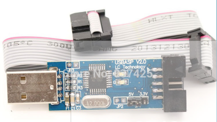
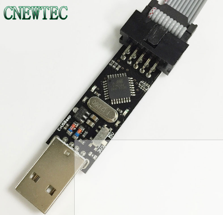

## USBasp Mods for PDI programming
The [FabPDI-mega8](fabpdi-mega8.md) programmer that I built is actually a USBasp modified for PDI programming. I started out by modifying existing USBasp boards that I had, before I designed and built FabPDI-mega8. The steps here are largely similar, except that there is no need to build your own board.

I had 2 versions of the commercial USBasp programmers, which I bought from Aliexpress, a unit marked as LC Technology USBasp V2.0 and a second unit from [Baite](www.betemcu.cn). The online price for these programmers range from USD1.20 to USD1.60 for single pieces and as low as USD7.30 for 10 pcs for the LC Technology version.

*LC Technology USBasp*

*Baite USBasp*

The main difference between these 2 boards is that in the case of the LC Technology programmer, **the 3V jumper only the Vcc of the programming header to 3.3V. The rest of the device, including the data lines is still operating at 5V**. For the Baite programmer, the 3V switch configures the entire board (Vcc, data lines) to operate at 3.3V.

What the above paragraph implies is that you need to make hardware modifications to the LC Technology programmer, in order to use it as a PDI programmer, whereas the Baite programmer does not require any hardware modification.

There are 3 parts to building the FabPDI-mega8 programmer:
1. Building a PDI programming cable
2. Modifying the USBasp board (required for LC Technology programmer) and uploading the modified USBasp firmware to it
3. Compiling a modified version of avrdude that recognizes the FabPDI-mega8 as a PDI programmer

My main references in modifying my commercial USBasp boards for PDI programming were articles from:
* [Szulat](http://szulat.blogspot.sg/2012/08/atxmega-programmer-for-050.html)
* [Ketturi](https://ketturi.kapsi.fi/2013/05/programming-xmega-with-usbasp-avrdude/)

## Building a PDI Programming cable
A regular USBasp uses a 5V supply. The ATxmega series ICs operate at 3.3V, including the data pins. There are a few ways to resolve this problem:
1. Use a separate 3.3V power supply and zener diodes to limit the voltages to 3.3V
2. Ensure that our FabPDI-mega8 can switch completely (including data pins) between 5V and 3.3V operation

2 versions of the PDI programming cable can be fabricated, depending on which of the 2 approaches above is used.

*PDI programming cable for a 5V board*

*PDI programming cable for a 3.3V board*

Keep the cable short to minimize issues with noise and timing disruptions to the PDI protocol. I spliced the 220 ohm resistors directly into the ribbon cable.

A regular 6-way cable is used for ISP programming.
